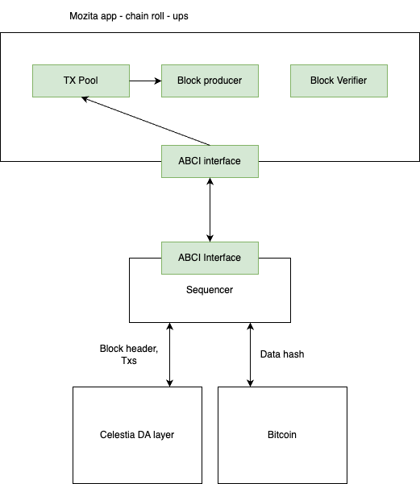

How would I submit blocks to Bitcoin?

# architecture overview



1. block producer
* produce blocks, then forward blocks to bitcoin

2. block verifier
* sequencer will fetch bitcoin blocks and then submit to block verifier (through ABCI)
* block verifier will then execute through all blocks to derive hash used for verification

# changes management
- [bitcoin client interface](../../da/bitcoin/bitcoin.go)
- [bitcoin node integration](../../node/bitcoin.go)
- [bitcoin client manager](../../block/manager.go)

# bitcoin client
bitcoin client structure
```go
// BitcoinClient interacts with Bitcoin layer
type BitcoinClient struct {

}
```

interacts with bitcoin layer through two functions:
* SubmitStateProofs: 
* RetrieveStateProofs

use btcd rpcclient to interact: https://github.com/btcsuite/btcd/tree/master/rpcclient

# manager
manager is responsible for aggregating transaction hashs into bitcoin and keep track of bitcoin blocks

```go
type Manager struct {
    // interaction interface with bitcoin
    btc *bitcoin.BitcoinClient
	// btcHeight is the height of the latest processed Bitcoin block
	btcHeight uint64
}
```

# node integration
fullnode integration

```go
type FullNode struct {
    btc          *bitcoin.BitcoinClient
}
```